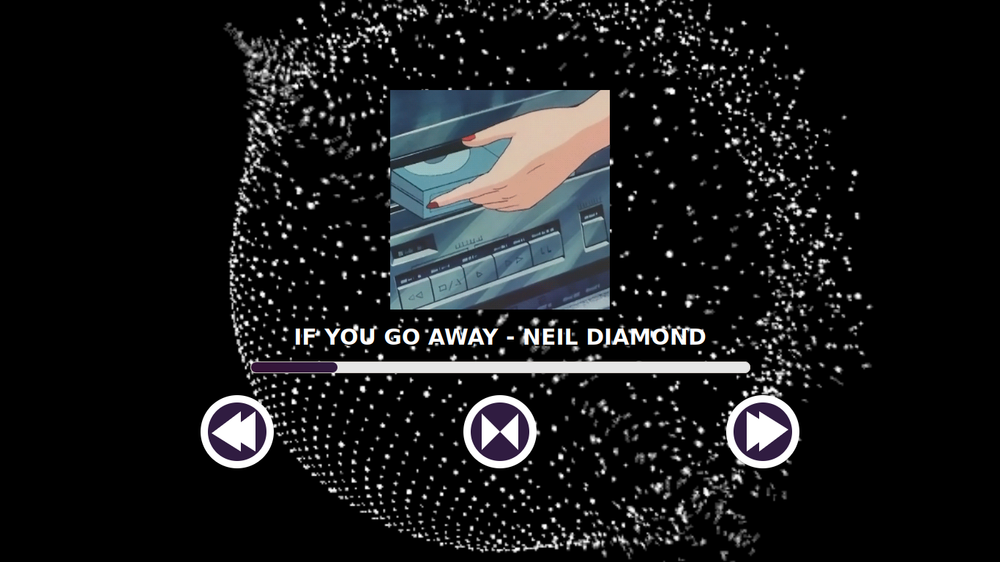

### Como usar

1) Clique em "Escolher Música"
2) Selecione os arquivos do formato .mp3
3) Pressione o play

#### Aviso:
Implementações futuras serão feitas, como;

 - Tempo do arquivo
 - Remoção do flicker
 - Capas

